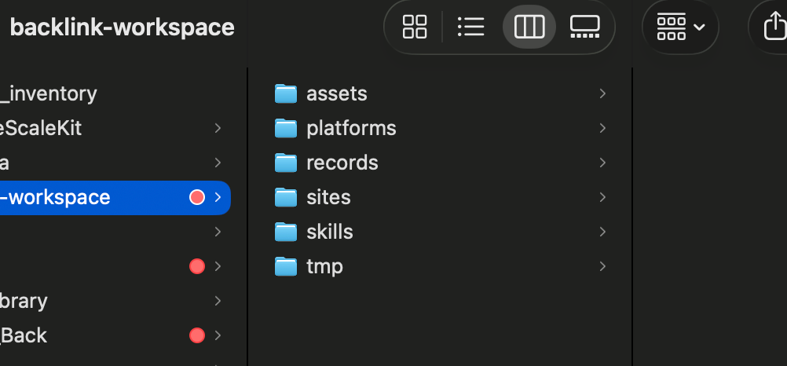

# 外链自动化提交 Skill

[简体中文](README.zh-CN.md) · [English](README.md)

这是一个可复用的 Codex Skill，用于低频、可恢复、可审计、以证据为准的白帽外链、产品目录和工具目录提交工作流。

它把外链提交当作一条可持续执行的队列，而不是一次性的浏览器操作。每次运行都会先读取上次游标、检查全部历史记录并去重，然后只处理下一个真正未执行的平台；每获得一个结果，就立即保存证据和下一游标。

## 为什么需要这个 Skill

常见的外链自动化问题包括：

- 新任务每次都从第一个 CSV、第一行重新开始；
- 同一个目录被重复提交；
- 技术检测平台生成了新的报告 ID，就被误算成新外链；
- 只是填完表单，还没有提交成功就被计数；
- 进度只留在浏览器标签页或模型记忆中；
- 登录、验证码、付费、badge 等阻塞点记录不准确；
- 把普通技术报告夸大成推荐、收录或高质量编辑外链。

本 Skill 对“恢复游标、终身去重、证据计数、逐项落盘和安全浏览器操作”设置了强制前置规则。

## 核心能力

- 按顺序执行多个 CSV，并在当前 CSV 完成后自动切换
- 打开任何平台前强制审计上一次游标
- 按目标网站独立维护跨任务进度
- 按平台、域名、路径、source key 和证据 URL 终身去重
- 正确处理 Typeform、Tally、Google Forms、Airtable 等共享表单域名
- 明确区分 `unprocessed`、`deferred` 和 `terminal`
- 统一“计数”和“不计数”状态
- 只使用用户授权、可见的浏览器账号
- 继续处理登录、OAuth、邮箱验证、magic link 和一次性验证码
- 上传已经批准的 logo、截图等站点资料
- 遵守 CAPTCHA、反滥用和安全警告边界
- 每处理一个候选平台立即保存状态和下一游标
- 提供零第三方依赖的只读队列审计脚本
- 提供完整工作区模板
- 每日生成可审计的 Markdown 结果

## 明确不会做的事情

本 Skill 不会：

- 创建虚假身份、评论、投票、粉丝或点赞；
- 为了外链制作空洞文章或薄内容站点；
- 使用链接农场、PBN 或黑帽外链市场；
- 绕过 CAPTCHA、Cloudflare、安全警告或反机器人机制；
- 检查或导出 Cookie、密码、Token、浏览器数据库；
- 未经批准进行付款；
- 编造公司、客户、流量、融资、招聘或效果数据；
- 承诺排名提升，或把技术检测页描述成平台推荐。

## 仓库结构

```text
backlink-automation-submission/
├── SKILL.md
├── README.md
├── README.zh-CN.md
├── LICENSE
├── agents/
│   └── openai.yaml
├── scripts/
│   └── audit_queue.py
├── references/
│   └── workspace-schema.md
└── assets/
    ├── readme/
    │   └── backlink-workspace-folders.png
    └── templates/
        ├── site-profile.md
        ├── queue.txt
        ├── public-platforms.csv
        ├── blacklist.csv
        ├── platform-progress.csv
        └── daily-log.md
```

## 运行工作区目录说明

上面的 Skill 仓库保存可复用的指令、脚本和模板。真正执行外链任务时，还需要一个独立的运行工作区，用于存放用户自己的站点资料、平台队列、素材和跨任务历史记录。



截图展示的运行目录结构如下：

```text
backlink-workspace/
├── assets/
├── platforms/
├── records/
├── sites/
├── skills/
└── tmp/
```

| 文件夹 | 是否必需 | 作用 | 持久化要求 |
|---|---|---|---|
| `assets/` | 建议保留 | 存放已经批准的 logo、截图、图标和其他站点素材 | 保留可重复使用的源素材 |
| `platforms/` | 必需 | 存放有序执行 CSV、`queue.txt` 和黑名单 | 长期保留，不得随意改变顺序 |
| `records/` | 必需 | 存放跨任务游标、逐平台状态、日报和可选证据 | 持久化的事实来源 |
| `sites/` | 必需 | 每个目标网站对应一份真实 Markdown 资料 | 持久化配置 |
| `skills/` | 可选 | 存放工作区内置的本 Skill 或其他自定义 Skill | 仅在使用自包含工作区时保留 |
| `tmp/` | 可选 | 存放临时截图、下载、转换文件和中间产物 | 不能作为长期状态 |

### `assets/`

这里只保存与目标网站明确相关、并且已经获准用于提交的文件：

```text
assets/
└── example-site/
    ├── logo.png
    ├── icon.png
    ├── screenshots/
    │   ├── dashboard.png
    │   └── feature.png
    └── documents/
        └── product-overview.pdf
```

站点资料文件应引用这里的素材路径。不要在此保存凭据、身份证明、私人客户数据、浏览器导出文件或无关个人文件。

如果平台因尺寸、格式或比例拒绝素材，应保留经过批准的原图，并把合法转换后的版本放在相同站点目录中，使用清晰文件名区分。

### `platforms/`

该目录决定“哪些平台可以执行”以及“以什么顺序执行”：

```text
platforms/
├── queue.txt
├── public-platforms.csv
├── high-authority-platforms.csv
└── blacklist.csv
```

- `queue.txt` 按顺序列出所有可执行 CSV 文件名；
- 可执行 CSV 包含 `platform`、`platform_url`、`category`、`notes`；
- `blacklist.csv` 只用于风险排除，绝对不能执行；
- 必须保留 CSV 行顺序，因为游标依赖文件名和行位置；
- 活跃 CSV 改名或重排前，必须先核对已有 `source_key`；
- 同一个平台出现在另一个 CSV 中，不会因此变成新外链。

### `records/`

该目录是整个工作流的持久化记忆：

```text
records/
├── platform-progress.csv
├── daily/
│   └── YYYY-MM-DD.md
└── evidence/
    └── optional-platform-proof.png
```

- `platform-progress.csv` 是游标恢复和去重的逐行事实来源；
- `daily/` 保存方便人阅读的每日摘要、证据链接、阻塞点、数量和下一游标；
- `evidence/` 是可选目录，可以保存用于证明平台结果的截图或文本抽取；
- 每处理一个候选平台后，必须立即更新进度和日报；
- 定时任务之间不能删除、清空或重新创建该目录；
- 日报游标与更靠后的逐行记录冲突时，必须先修复记录，之后才能打开平台。

### `sites/`

每个真实目标网站对应一个 Markdown 资料文件：

```text
sites/
├── ExampleSite.md
└── AnotherProduct.md
```

资料应包含规范网址、产品介绍、目标用户、分类、标签、联系邮箱、已批准素材路径、授权浏览器账号、可用平台账号和限制条件。

系统按 `Website Name` 隔离不同网站的进度。第一次运行后应保持这个名称稳定。除非用户明确要求，否则应排除 demo 或 test 资料。

### `skills/`

这是可选目录，用于建立一个可以独立移动的自包含工作区：

```text
skills/
└── backlink-automation-submission/
    ├── SKILL.md
    ├── scripts/
    ├── references/
    └── assets/
```

当自动化运行器从工作区加载 Skill 时使用该目录。如果 Skill 已经全局安装在 `~/.codex/skills/` 或其他 Agent 管理目录中，可以省略它。

不要把执行记录或目标站点素材混入 `skills/`。这里应只保存可复用指令和配套资源。

### `tmp/`

该可选目录只用于一次任务中的临时文件：

- 临时截图；
- 当前提交需要的下载文件；
- 转换后的图片版本；
- 临时文本抽取；
- 短期浏览器交接产物。

禁止在 `tmp/` 中保存密码、一次性验证码、Cookie、Token、浏览器账号目录或永久游标。即使该目录为空，下一次任务也必须能够正常恢复。

## 使用要求

- Codex，或其他能够加载 `SKILL.md` 的 Agent 运行环境
- Python 3.9 或更高版本
- 用于真实提交的可见浏览器/电脑控制能力
- 用户所有或明确授权的浏览器账号和平台账号
- 根据仓库模板建立的外链工作区

`scripts/audit_queue.py` 只使用 Python 标准库，不需要安装第三方依赖。

## 安装

### 安装到 Codex

将仓库克隆到 Codex skills 目录：

```bash
git clone https://github.com/cuilinhao/backlink-automation-submission-skill.git \
  ~/.codex/skills/backlink-automation-submission
```

重新启动或刷新 Codex，使 Skill 被识别。

显式调用：

```text
$backlink-automation-submission
```

### 安装到其他 Agent

克隆仓库，然后根据该 Agent 的 Skill 加载方式注册仓库根目录的 `SKILL.md`。不要改变 `scripts/`、`references/` 和 `assets/` 的相对路径。

### 更新

```bash
git -C ~/.codex/skills/backlink-automation-submission pull --ff-only
```

## 快速开始

### 1. 创建工作区

示例：

```bash
mkdir -p ~/backlink-workspace/{sites,assets,platforms,records/daily}

cp ~/.codex/skills/backlink-automation-submission/assets/templates/site-profile.md \
  ~/backlink-workspace/sites/ExampleSite.md

cp ~/.codex/skills/backlink-automation-submission/assets/templates/queue.txt \
  ~/backlink-workspace/platforms/queue.txt

cp ~/.codex/skills/backlink-automation-submission/assets/templates/public-platforms.csv \
  ~/backlink-workspace/platforms/public-platforms.csv

cp ~/.codex/skills/backlink-automation-submission/assets/templates/blacklist.csv \
  ~/backlink-workspace/platforms/blacklist.csv

cp ~/.codex/skills/backlink-automation-submission/assets/templates/platform-progress.csv \
  ~/backlink-workspace/records/platform-progress.csv
```

### 2. 填写站点资料

编辑 `sites/ExampleSite.md`：

```markdown
# Website profile

- Website Name: ExampleSite
- Website URL: https://example.com
- One-liner: 一句真实、简洁的产品介绍。
- Long Description: 只使用经过确认的事实描述产品。
- Target Users: 创作者、代理商、营销团队
- Categories: Creator Tools, Analytics
- Tags: research, analytics, video
- Contact Email: support@example.com
- Logo Path: assets/example-site/logo.png
- Screenshot Paths: assets/example-site/dashboard.png
- Authorized Browser Profile: Work
- Available Accounts: Work 浏览器账号中已有 Google 和 GitHub 登录
- Constraints: 不购买付费外链；不发布客座文章
```

平台需要的字段不能含糊。不要添加用户未授权的个人身份或商业声明。

### 3. 创建平台队列

在 `platforms/queue.txt` 中按顺序写入可执行 CSV，每行一个文件名：

```text
public-platforms.csv
high-authority-platforms.csv
```

平台 CSV 的格式：

```csv
platform,platform_url,category,notes
Example Directory,https://directory.example.com/submit,product-directory,免费的人工审核目录
Example Audit,https://audit.example.com,technical-report,整个生命周期最多计数一次
```

必须保留 CSV 顺序。黑名单、失败归档和历史导出文件绝不能写入 `queue.txt`。

### 4. 维护黑名单

使用 `platforms/blacklist.csv`：

```csv
platform,platform_url,reason
Unsafe Example,https://unsafe.example.com,链接农场
```

优先按 URL 和路径匹配。对于共享表单域名，不要仅凭域名把全部表单列入黑名单。

### 5. 运行 Skill

示例提示词：

```text
使用 $backlink-automation-submission。
工作区：/absolute/path/to/backlink-workspace
目标网站：ExampleSite
完成 3 条新的、唯一的、可计数外链。
只使用站点资料中配置的 Authorized Browser Profile。
只有未经批准的付费步骤才跳过；其他无法完成的步骤准确记录为 deferred。
```

## 每次运行前的强制审计

在打开任何候选平台前，每次任务都必须：

1. 读取目标站点资料；
2. 读取 `platforms/queue.txt` 和所有可执行 CSV；
3. 读取黑名单；
4. 读取该目标网站的全部进度行；
5. 读取最新日报和相关历史日报；
6. 运行队列审计脚本；
7. 对比日报游标和逐行进度；
8. 把最终确认的游标写入今天的日报。

手动运行审计：

```bash
python3 ~/.codex/skills/backlink-automation-submission/scripts/audit_queue.py \
  --workspace /absolute/path/to/backlink-workspace \
  --website "ExampleSite"
```

输出 JSON：

```bash
python3 ~/.codex/skills/backlink-automation-submission/scripts/audit_queue.py \
  --workspace /absolute/path/to/backlink-workspace \
  --website "ExampleSite" \
  --json
```

该脚本是只读的，不会修改 CSV 或日报。

## 游标恢复机制

逐行进度文件是持久化状态的主要来源，日报是方便人阅读的摘要。

每次启动时，Skill 会：

- 找到最后一个已经持久化为 `deferred` 或 `terminal` 的队列行；
- 与最新日报中的 `Next cursor` 对比；
- 报告游标是否一致；
- 从已确认位置之后的第一条未处理记录继续；
- 没有剩余记录时报告队列已耗尽。

如果日报游标过期，但存在更靠后的逐行记录，以逐行记录为准。如果两者无法核对，必须先修复记录，禁止直接打开平台。

## 终身去重机制

去重按目标网站独立进行，综合比较：

- 规范化平台名称；
- 去掉大小写和 `www` 的域名；
- 提交路径；
- `source_key`；
- `dedupe_key`；
- 历史证据 URL；
- 历史日报。

以下情况都属于重复：

| 之前的结果 | 新候选 | 处理方式 |
|---|---|---|
| `example.com/submit` | `www.example.com/add-product` | 同平台/域名重复 |
| 技术报告 `report/123` | 技术报告 `report/456` | 技术平台重复 |
| 已存在公开 listing | 再次提交同一 listing 的更新表单 | 已存在 listing 重复 |
| 平台出现在 CSV A | 同一平台又出现在 CSV B | 跨 CSV 重复 |
| 同一域名更换查询参数 | 刷新查询 | 重复 |

重复项必须记录为 terminal `duplicate-existing`，备注中关联之前的证据，不得再次提交，也不能计入当天新外链。

对于共享表单域名，必须比较路径或 form ID。两个不同 Typeform 表单可能属于两个不同平台，必须确认真实目标平台后再判断是否唯一。

## 证据计数规则

只有平台自身出现以下至少一种明确结果时才能计数：

- submitted；
- submission received；
- pending review；
- scheduled；
- live/public listing；
- 包含该目标网站的后台记录；
- 包含目标域名的公开验证页。

以下情况不能计数：

- 只填表但未提交；
- 草稿；
- 资料不完整；
- 付费页面；
- 验证未完成；
- 重复项；
- 平台不相关；
- badge 未安装；
- 最终页面没有保留目标相关证据；
- 新提交任务中发现的历史 listing。

技术检测页只是公开足迹证据，不是编辑推荐。除非用户明确要求历史盘点，同一个技术平台对同一个目标网站最多计数一次。

## 浏览器和账号安全

站点资料必须配置授权浏览器账号。任何操作前都要确认当前可见账号一致。

工作流可以通过可见、已授权界面继续处理：

- 已登录会话；
- 注册；
- 已授权 OAuth；
- 邮箱验证和 magic link；
- 已可访问邮箱中的一次性验证码；
- 经过批准的素材上传；
- 最终提交按钮。

工作流禁止：

- 检查浏览器数据库、Cookie、密码和 Token；
- 绕过 CAPTCHA 或反机器人机制；
- 忽略安全警告；
- 未经批准付款；
- 猜测应该使用哪个身份或账号；
- 上传无关或私人文件。

如果确实缺少权限或凭据，必须保留在准确操作节点，并记录为 `deferred`。

## 状态模型

| 状态 | 含义 |
|---|---|
| `unprocessed` | 没有发生有效尝试，也没有结论 |
| `deferred` | 仍有以后可以恢复的阻塞点 |
| `terminal` | 已计数成功，或已经得到明确的不计数结论 |

常见计数状态：

```text
submitted
submission-received
pending-review
scheduled
public
live
verified
```

常见不计数状态：

```text
duplicate-existing
paid
blacklisted
not-relevant
unavailable
login-required
email-verification
captcha
badge-required
draft
incomplete
failed
unclear
```

## 逐项实时保存

每处理完一个候选平台、打开下一行之前，必须：

1. 更新对应的进度行；
2. 保存准确状态和证据；
3. 更新当天 processed/deferred/remaining 数量；
4. 更新 `Next cursor`；
5. 确认游标指向第一条真正未处理的记录。

禁止把一批结果只保存在模型记忆中。任务被中断后，必须重新执行完整的启动审计。

## 定时任务

可以通过所使用的自动化系统定时调用该 Skill。任务提示词要足够明确：

```text
每天 07:30 使用 $backlink-automation-submission。
工作区：/absolute/path/to/backlink-workspace
目标：10 条新的、唯一的、可计数结果。
从持久化游标继续。
不得重复之前已经计数的平台。
只有未经批准的付费步骤才跳过。
每处理一项立即保存。
结束后报告已计数证据、重复项、付费项、deferred 的准确节点、
当前 CSV、剩余数量和下一游标。
```

定时执行不会扩大权限范围。浏览器账号、付费策略、身份约束和反滥用规则仍然有效。

## 常见问题排查

### 每次都从头开始

- 检查 `records/platform-progress.csv`；
- 确认 `website` 与站点资料名称完全一致；
- 检查 `source_key` 是否与当前 CSV 文件名、网址一致；
- 运行 `audit_queue.py`；
- 核对逐行进度后再修复日报 `Next cursor`。

### 同一个平台再次出现

- 比较规范化域名和 `dedupe_key`；
- 搜索历史日报；
- 检查平台是否出现在其他 CSV；
- 记录为 `duplicate-existing`，不要再次提交。

### 脚本报告游标过期

使用根据逐行持久化记录计算出的游标。浏览前先更新当天的启动审计记录。

### 平台要求付费

没有明确批准时，记录 terminal `paid`，然后继续下一候选平台。

### 要求登录、OAuth、邮箱或验证码

只使用授权的可见浏览器账号和已授权账户。如果无法在不猜测的情况下确定正确账号或邮箱，就停在准确节点并记录 deferred。

### 出现 CAPTCHA 或反机器人验证

不得绕过。只使用当前控制工具要求的即时确认或最小范围人工接管。

### 要求安装 badge

只能通过用户授权的网站后台或代码流程安装。如果没有可用后台权限，在 badge 节点记录 deferred。

### 队列已经耗尽

报告队列耗尽。除非用户明确要求重新审计，否则不得回到第一个 CSV。

## 验证

验证 Skill 结构：

```bash
python3 /path/to/skill-creator/scripts/quick_validate.py \
  /path/to/backlink-automation-submission
```

验证审计脚本：

```bash
python3 -m py_compile scripts/audit_queue.py
python3 scripts/audit_queue.py --help
```

## 参与贡献

欢迎提交改进，但必须保留：

- 真实、白帽的提交原则；
- 严格终身去重；
- 打开平台前先恢复游标；
- 每项结果立即落盘；
- 以平台证据为计数依据；
- 只操作可见、授权的账号；
- 反滥用和付费保护。

不要在 Issue 或 PR 中提交密码、Token、私人站点资料、浏览器状态、个人记录或生产凭据。

## 许可证

MIT，详见 [LICENSE](LICENSE)。
